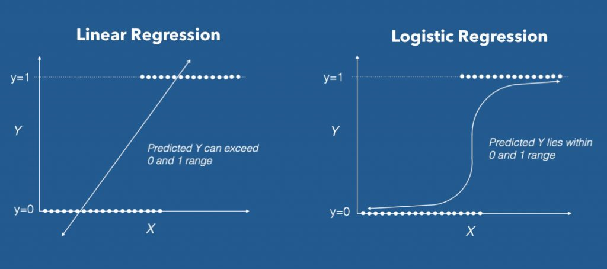

```{r, echo=FALSE}
htmltools::img(src = knitr::image_uri('Atrium_White_Vertical.png'), 
               alt = 'logo', 
               style = 'position:absolute; top:10px; left:2px; padding:2px;height:100px;')
htmltools::img(src = knitr::image_uri('Atrium_FullColor_Vertical.png'), 
               alt = 'logo', 
               style = 'position:absolute; top:10px; right:2px; padding:2px;height:100px;')
               
```

```{r setup, include=FALSE}
knitr::opts_chunk$set(echo = TRUE)
library(dplyr)
library(lubridate)
```
Welcome to Atrium University! We are devoted to developing Atrians' skills at understanding and using machine learning tools. This Linear Regression primer is one of a series on common data science tools and their application in R. See other Atrium University tools in this series to learn about other methods. 

# Introduction

Far and away, the tools most used in Machine Learning are regression-based. **Linear Regression** and **Logistic Regression** are the easiest to understand and most commonly utilized regression tools; however, there are others available as well. 

This document covers the basics of linear regression, including:

+ **What is linear regression?**
+ **How does it differ from logistic regression?**
+ **Common Regression Problems: Model Selection**
+ **Common Regression Problems: Inference**
+ **Common Regression Problems: Prediction**
+ **How do I implement this tool in R?**
+ **How do I use Einsteing Discovery's regression tools?**

Before we jump in, note that linear regression is a powerful statistical tool. Entire books have been written solely on this subject - this is just an overview of how you can get started. For a more technical overview of the subject matter, we suggest the following books:

+ **Applied Predictive Modeling** (Max Kuhn and Kjell Johnson) [**Found at**: [link](http://appliedpredictivemodeling.com/)] *Description*: A technical overview of how to implement ML methods in R. 

+ **Naked Statistics** (Charles Wheelan)[**Found at**: [link](https://www.amazon.com/Naked-Statistics-Stripping-Dread-Data-ebook/dp/B007Q6XLF2)]  *Description*: A high-level overview of regression tools from a social science perspective. Good context. 

+ **The Elements of Statistical Learning** (Trevor Hastie, Robert Tibshirani, and Jerome Friedman) [**Found at**: [link](https://web.stanford.edu/~hastie/ElemStatLearn/)] *Description*: A thorough and advanced treatment of many ML tools, including linear regression. Available FREE at the link. 

**Know any good statistics/ML textbooks?** *Email paul@atrium.ai and we will post them to the Wookie.*


#What is linear regression?

Linear regression refers to a statistical tool that relates a response variable, $Y$, to a suite of  predictor variables, called $x_{1}...x_{p}$.  The model that relates these is written as follows: 
$$Y_{i} = \beta_0 + \beta_1x_1 + ...\beta_px_p + \epsilon_i $$ 
In the model, $\beta_0$ refers to the intercept, which we interpret as the predicted $Y$ response value if all of the predictor values are equal to 0. The $\beta_1...\beta_p$ terms refer to the true estimated change in the response, $Y$, associated with a one-unit change in a single input variable $x_1...x_p$.  Finally, because this is a true model, we also consider an error term $\epsilon$ that is assumed to be *normally distributed* with 0 mean and constant standard deviation $\sigma$. This means that the model is assumed to miss below the true value about as often as it misses above. 

That's a lot of math! What does this mean for predictive analytics? Here's some Linear Regression quick hits: 

+ Linear regression models allow us to predict a new response value $Y$ for a given set of information ($x_1...x_p$). 

+ The model will rarely predict with perfect accuracy (it's a statistical model), but on average, it will predict values above the true mean about half the time, and values below the true mean the other half of the time. 

+ Multiple linear regression (i.e. regression with more than one variable) allows us to isolate the effect of a single variable (say, $x_1$) **controlling for** the effect of the other variables in the model. This is a major advantage over, say, making dashboards to diagnose trends. 


## How do linear regression and logistic regression differ?

Without getting into too many technical details, linear regression is used when the response variable of interest takes on quantitative, continuous values. If you're interested in predicting Sales Prices, Ages, Times (like, say, for a sales opportunity to close), Heights or Weights, etc., linear regression is a go-to tool for analysis. 

Logistic regression works differently - it predicts values between 0 and 1 and should be used when the number of values that the response can take is binary (either 0 or 1). For more information about logistic regression, see the Logistic Regression primer! 

```{r pressure, echo=FALSE, fig.cap="Logistic Regression requires binary response values and produces predicted probabilities. Linear Regression requires continuous, numerical response values and can predict an entire spectrum of responses.", out.width = '100%'}

```

## Model Selection
One common question associated with any regression problem is to decide which variables should be used. In general, it is a good idea to collect as much data as possible, but if the variables that you collect are not good predictors of the outcome you are trying to explain or predict, they should not be included in the model. 

**Why would I remove information from a model?** A good question, indeed. There are several reasons that you might want to remove a variable. 

**Multicollinearity**: If two variables are highly related to each other, the model cannot identify the effect of either variable very well. Consider the following example: If we are interested in estimating the average test score for a group of students (of all ages), we might have both their age and their school grade as predictors. However, it is likely that (with a few possible exceptions), most of the students in the same age are in the same grade (i.e. most 7 year-olds are second-graders). Including both variables means we can't really separate out whether an effect on the test score is due to age or additional years of school. 
```{r, echo = FALSE, fig.align = 'center', fig.cap = "Here's an example of why it woudl be a bad idea to include Grade and Age in a model. They include almost the exact same information, so we can't differentiate between the two variables."}
library(ggplot2);library(tibble)
age <- sample(6:12,100, replace = TRUE)
grade <- age -5 + ifelse(abs(rnorm(100,0,1))>2,1,0)
df <- tibble(age, grade)
ggplot(df, aes(age, grade)) + theme_bw() + geom_point(size = 3, color = "dodgerblue3") + 
  xlab("Age of Student") + ylab("Grade of Student") + ggtitle("Age vs. Grade") 
```


**Bad variables**: In general, adding variables to a model will improve predictive performance. However, if the added variable is unrelated to the response of interest, or only a little bit, it may not be worth adding it in. **Key idea: SIMPLE MODELS ARE GENERALLY PREFERABLE TO COMPLICATED ONES**. 

Often, bad variables can be identified by fitting models with different variables included and comparing Akaike's An Information Criterion (AIC) values. Smaller AIC values mean that the model is a better fit to the data.  

*Other tools for automated model selection exist. Stepwise model selection, including Forward and Backward Selection, add or subtract variables and choose the model with the minimum AIC value.  Lasso Regression imposes a "regularization" penalty that shrinks the coefficients for all the variables in the model, setting the smallest ones to 0.*


## Inference

A key goal of linear regression is that the tools used here are often used to describe an actual process. For us, a process is usually related to customer purchasing behavior, sales outcomes, or other business-related processes. Generally, our customers want to know more about the role each variable they collect information on plays in that process. 

*For example*: A customer might want to know about how the price of a product they sell impacts the quantity of their sales. Multiple Regression (i.e. linear regression with more than 1 variable) allows for us to estimate the effect of price, controlling for the effect of other variables in the model! 


## Prediction

The other primary use case for linear regression is for prediction or forecasting. A good model should be able to produce a reasonable prediction output for a new input of data. 


##Trying it in R:

Consider the following scenario. You are trying to determine whether or not having a garage impacts the sales price of a home. You collect data on home sales in your city (which, in this case, happens to be Grand Junction, Colorado). Then, you plan to analyze it in R via the following steps:

```{r tryit1}
#reads in the data from a .csv file (generally easiest way to get into R)
mcdat <- read.csv('mcdat.csv',header = TRUE)

head(mcdat,10) #returns the first 10 rows of data
dim(mcdat) #tells us we have 163 observations on 38 variables

mcdat$Garage <- ifelse(mcdat$Garage.sqft %in% c('y','Y'),1,0)

```

Every dataset contains variables that are not necessarily good predictors. In this case, we filter out all the variables that are included in the dataset but are not necessary for analysis. (Note: This can sometimes be hard to figure out. Talk to your domain experts (i.e. customers) when determining which variables are unrelated to the process (i.e. comment-variables, etc.))

We can also treat sales date in a more intuitive way using a package called lubridate (Grolemund and Wickham, 2011). 

```{r variable2}
#some variables don't make sense to use as predictors, they're just added information we don't need
mcdat_r <- mcdat[,c('Date','ACRES','Total_HeatedSqFtV','Min_EFFECTIVEYEARBUILT','BEDROOM',"Full.Bath",'Garage','Price')]

library(lubridate) #allows you to better formulate dates 
mcdat_r$Month <- month(mdy(mcdat_r$Date)) #this gives us just the sales month
```

We are now ready to try fitting a model. Let's start with a simple linear regression that looks at whether or not the presence of a garage has an effect on house price. 

```{r linmod3, fig.align = 'center'}
#linear model (simple linear regression)
slr1 <- lm(Price ~ Garage, data = mcdat_r)
summary(slr1)

#assess diagnostics
par(mfrow = c(2,2))
plot(slr1, pch = 20)
```

Based on the results above, we can see that the a house with a garage is estimated by the model to sell for $83,498 more than a house that does not have a garage, on average. The p-value associated with the Garage variable is very small, indicating strong statistical evidence that there is indeed a true difference in sales price between houses that have a garage and houses that do not.  

Note that this does not take into account any other information about the house. You probably think that houses without garages may have other characteristics that might differ from houses with garages. Moreover, you want to leverage as much information as you can so that you can isolate the effect of garages. 

That moves us into the world of multiple linear regression. Here, we can examine many predictor variables at a time. The way you implement MLR in R is the same as you would in a single variable regression, but you can use the + sign to add variables to the model formula. 


```{r mlr4, fig.align = 'center'}
#multilple linear regression
mlr1 <- lm(Price ~ ACRES + Total_HeatedSqFtV + BEDROOM + 
             Full.Bath + Garage + Month, data = mcdat_r[,-1])

#model summary
summary(mlr1)

#diagnostics
par(mfrow = c(2,2))
plot(mlr1, pch = 20)
```

```{r effectsplot, fig.align = 'center', fig.width = 10}
#visualize the model: Effects Plots plot the estimated mean at each level of the group
library(effects)
plot(allEffects(mlr1))
```


