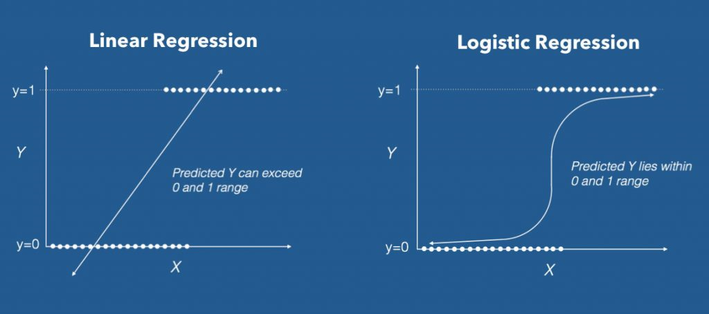

```{r, echo=FALSE}
htmltools::img(src = knitr::image_uri('Atrium_White_Vertical.png'), 
               alt = 'logo', 
               style = 'position:absolute; top:10px; left:2px; padding:2px;height:100px;')
htmltools::img(src = knitr::image_uri('Atrium_FullColor_Vertical.png'), 
               alt = 'logo', 
               style = 'position:absolute; top:10px; right:2px; padding:2px;height:100px;')
               
```

```{r setup, include=FALSE}
knitr::opts_chunk$set(echo = TRUE)
library(dplyr)
library(lubridate)
library(DT)
library(plotly)
library(ggpubr);library(pander)
```

Welcome to Atrium University! We are devoted to developing Atrians' skills at understanding and using machine learning tools. This Linear Regression primer is one of a series on common data science tools and their application in R. See other Atrium University tools in this series to learn about other methods. 


## Linear Regression vs. Logistic Regression: What's the Difference? 

Logistic Regression is a uesful tool for both regression and classification problems. Although its name sounds similar to linear regression, it's actually pretty different!  Remember the plot below from the Linear Regression primer? This shows a linear regression model vs. a logistic regression model. Notice that for the **linear regression**, the response variable can take on any continuous value - it generates a straight line with a predicted slope. 

In contrast, **Logistic regression** produces a prediction that is **bounded** by 0 and 1 - it produces predicted probabilities rather than predicted outcome values. By splitting those probabilities into two groups, we can obtain predicted outcomes. Usually predicted probabilities of .5 or bigger are binned into predicted "successes" (i.e. 1's) and predicted probabilities that are less than .5 are binned into predicted "failures". 


```{r pressure, echo=FALSE, fig.cap="Logistic Regression requires binary response values and produces predicted probabilities between 0 and 1. Linear Regression requires continuous, numerical response values. Foud at: machinelearningplus.com.", out.width = '100%'}

```

## The Model

In logistic regression, we first assume that the response variable of interest, $Y_i$, takes on only 0 or 1 values with probability $\theta$ (this is called a **Bernoulli distribution**).
$$Y_i \sim Bernoulli(\theta)$$
Then, we can relate the probability of success, $\theta$, to the predictors using something called the **logit** link function.  This sounds weird, but the name "logit" refers to the log of the odds of success: 

First, consider the **odds** of success. We can think of the odds as the probability of success divided by the probability of failure for any given observation.  
$$ Odds_i = \frac{\theta}{1-\theta}$$ 

Then, the logit function that relates the odds to the predictor variables is shown below:  
$$logit(\theta) = log(\frac{\theta}{1-theta}) = \beta_0 + \beta_1x_1 + ... + \beta_kx_k $$

Confused yet? There is a lot of math that underlies logistic regression, but remember that the goal is to predict values of $\theta$ that live between 0 and 1 (because they are supposed to be probabilities). The logit-link function does this very efficiently while producing interpretable, easy to use results. 

## Important Assumptions to Make: 

As always, there are a few important assumptions to make when fitting a valid logistic regression model.

+ **First and foremost, the response needs to be binary!**

+ **The model needs to train on both failures and successes. If we have a dataset that contains only 0's or 1's, we cannot determine which factors are important in distinguishing successes from failures.** 

+ **There are no influential points or extremely large outliers in the dataset. (This is always a good idea to check!)** 

+ **Unlike linear regression, the predictor variables need not be linearly related to the response; however, the relationship between the logit of the outcome and the predictors should be linear.** 


## Common Use Cases
Common use cases of logistic regression models often involve propensity scoring (i.e. estimating probabilities of success) and prediction of outcomes (predicting which responses should be successes and/or failures, given the input data). A few examples of use cases for logistic regression models are given below: 

+ **Opportunity Scoring**: In this case, data on sales opportunities are collected and used to fit a logistic regression model. Predicted propensities can be thought of as predicted probabilities that a potential sale will convert into a successful sale. Often it is of interest to rank opportunities by predicted probability of success.  It can also be used to identify which variables are important to converting successful sales. '

+ **Lead Scoring**:  Similar to opportunity scoring, lead scoring takes information about potential sales leads and generates a predicted probability of a lead being successful. We can think of leads with higher probability of success as being more valuable, so we would rank them from highest predicted probability to lowest predicted probability. 

+ **Market Predictions**: Say you were interested in analyzing the stock market, but rather than predicting an actual price, you might be interested in the behavior of the price: i.e., whether the price of a given stock goes up (1) or goes down (0) relative to the day before. Logistic regression could be used to generate a predictive model of stock price behavior over time. 

+ **Spam Detection**: A common use of logistic regression is to detect and classify which emails are spam and which are not. Given information about the characteristics of an email, a logistic regression model would estimate a predicted probability that an email is spam. Emails with spam probability over a certain threshold could then be filtered out automatically. 


## Great Resources to Check Out: 

Logistic Regression is a powerful machine learning tool. Because it is easier to interpret and implement than some of the newer machine learning methods (i.e. Support Vector Machines, Neural Networks, etc.), it is one of the most commonly used tools for both regression and classification problems. 

**Links**:

+ **Analytics Vidhya: Simple Guide to Logistic Regression in R** [**Found at**: [link](https://www.analyticsvidhya.com/blog/2015/11/beginners-guide-on-logistic-regression-in-r/)]

+ **Logit Regression**: R Data Analysis Examples [**Found at**: [link](https://stats.idre.ucla.edu/r/dae/logit-regression/)]


**Books**:

+ **Applied Predictive Modeling** (Max Kuhn and Kjell Johnson) [**Found at**: [link](http://appliedpredictivemodeling.com/)] *Description*: A technical overview of how to implement ML methods in R. 

+ **Foundations of Linear and Generalized Linear Models** (Alan Agresti)[**Found at**: [link](https://www.amazon.com/Foundations-Linear-Generalized-Probability-Statistics/dp/1118730038)]  *Description*: A technical overview of the details of generalized linear models, including logistic regression and related multi-category multinomial regression. Technical, requires some knowledge of statistics. 

+ **The Elements of Statistical Learning** () [**Found at**: [link](https://web.stanford.edu/~hastie/ElemStatLearn/)] *Description*: A thorough and advanced treatment of many ML tools, including linear regression. Available FREE at the link. 


**Know any good statistics/ML textbooks, websites or videos?** *Email paul@atrium.ai and we will post them to the Wookie.*


